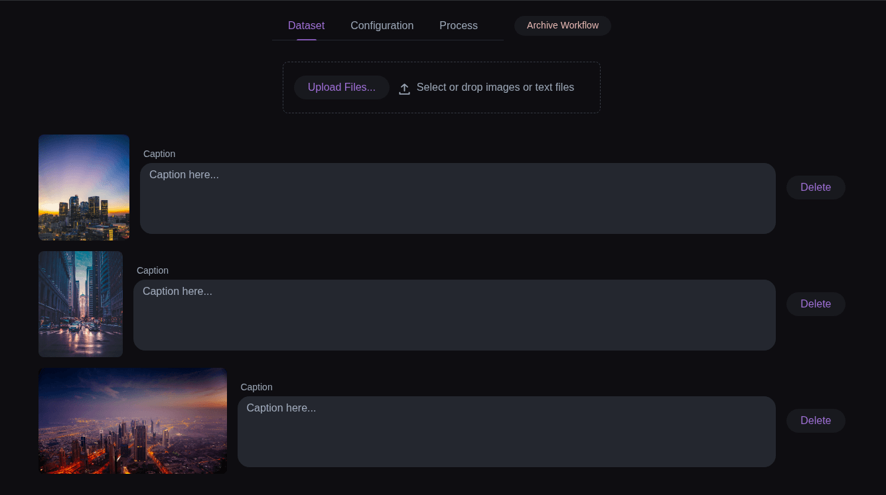
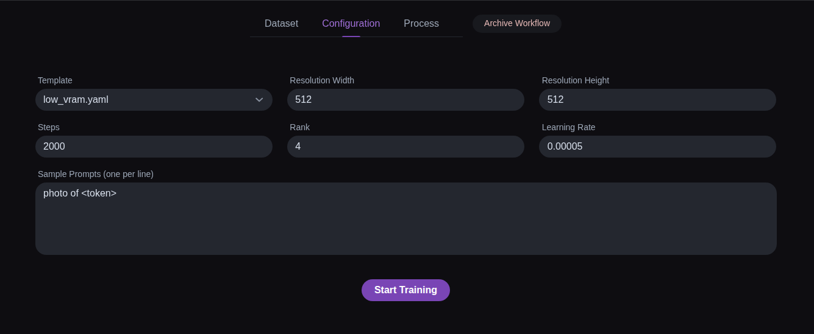

# LoRA-Lite

LoRA-Lite is a simple web interface for training LoRA models on AMD GPUs – no command line, no manual wiring.    
You start a Docker container, open the browser, and manage your datasets, templates, and training runs from a single page.

## Who is it for?

LoRA-Lite is designed for people who:

- Want to train LoRA models without dealing with complex scripts.
- Have an AMD GPU with ROCm and Docker installed.
- Prefer a visual UI over terminal commands.

It is meant for personal use and experiments, not for multi-user or production deployments.

## What you can do

- Upload images and captions for your training dataset.
- Crop images directly in the browser.
- Configure LoRA training settings using simple forms and templates.
- Start and stop training jobs from the UI.
- Watch live logs and see sample images from the current run.
- Keep your past experiments archived in timestamped folders.

## Quick start with Docker

1. Make sure Docker and docker-compose are installed on your machine.
2. Save the following as `docker-compose.yml` in an empty folder:

         services:  
   		 lora-lite: 
   			 image: thoenehannes/lora-lite-amd:latest
   			 container_name: lora-lite
   			 restart: unless-stopped
   			 devices:
   				 - /dev/kfd
   				 - /dev/dri                 
   			security_opt:  
   				 - seccomp=unconfined
   				 - ipc: host  
   			 shm_size: "16g"
   			 ports:  
   				 - "127.0.0.1:8080:8080"
   			volumes:  
   				 - ./data/dataset:/workspace/dataset 
   				 - ./data/output:/workspace/output 
   				 - ./data/configs:/workspace/configs 
   				 - ./data/logs:/workspace/logs
   				 - ./data/hf-cache:/workspace/.cache/huggingface
   				 - ./data/archive:/workspace/archive 
   				 - ./data/templates:/workspace/templates
   			environment:  
   				 - VAADIN_PRODUCTION_MODE=true
   				 - AI_TOOLKIT_AUTH=${AI_TOOLKIT_AUTH:-password}
   				 - HF_HOME=/workspace/.cache/huggingface
   				 - TRANSFORMERS_CACHE=/workspace/.cache/huggingface
   			working_dir: /workspace  

3. Start LoRA-Lite:

        docker compose up -d

4. Open your browser and go to: `http://localhost:8080`.

From here, you can upload images, create datasets, choose a template, and start training from the web UI.

## Requirements

- Docker and docker-compose
- An AMD GPU with a working ROCm setup on the host

Everything else (Java, Python, ai-toolkit) is already included in the Docker image.

## Screenshots

    

## License

This project is licensed under the Apache License 2.0 – see the `LICENSE` file for details.